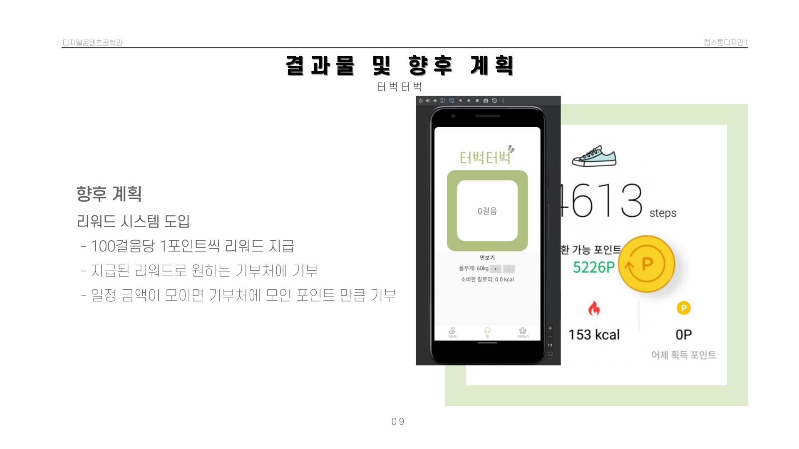

# 터벅터벅
기부와 운동을 동시에 할 수 있는 애플리케이션

## 프로젝트 설명
- 현대 사회에서 기부는 사회적 책임의 일환으로 인식되고 있다. 그러나 우리나라의 기부 문화는 아직까지 선진국들에 비해 부족한 실정이다. 이에 따라, 우리는 기부와 운동을 동시에 할 수 있는 애플리케이션을 개발하고자 한다. 이 애플리케이션은 사용자들이 운동을 하면서 기부를 할 수 있는 기회를 제공하여 기부 문화를 확산시키는 데 기여할 것이다.

- 기존 유사 콘텐츠를 말하자면 '캐시 워크'를 말할 수 있다. 기존 '캐시 워크'는 만보기 걸음 수를 기반으로 적립금을 적립하고 걸음 수에 비례하여서 적립금이 적립된다. 또한 적립금을 가지고 사용자가 상업적, 금전적인 보상을 활용하여 개인적인 이득을 취하는 반면에 우리가 만든 작품은 기존 '캐시 워크'처럼 만보기 기능을 넣고 걸음 수를 적립하는 부분과는 동일한 콘텐츠이지만 여기에 추가적으로 기부처를 소개해 주는 기능을 넣음으로써 기부에 익숙하지 않은 사람들을 위해 다양한 기부처를 소개해 주고 사이트를 연결해 주는 차별성이 있다.

 -기부와 운동을 동시에 할 수 있는 애플리케이션을 개발하는 것은 기부 문화를 확산시키고, 사용자들의 건강과 삶의 질을 향상시키는 데 매우 중요하다. 우리는 선행연구와 자료조사를 바탕으로, 사용자들이 운동을 하면서 기부를 할 수 있는 애플리케이션을 개발하고자 한다. 이를 위해 사용자들이 쉽게 기부를 할 수 있는 시스템을 구축하고, 다양한 기부처를 소개하는 기능을 추가할 예정이다.
앞으로 우리는 개발 과정에서 사용자들의 의견을 적극적으로 수렴하고, 지속적인 개선과 발전을 통해 더욱 완성도 높은 애플리케이션을 만들어 나갈 것이다. 이를 통해 우리 사회에 기부 문화가 더욱 확산되고, 사용자들의 건강과 삶의 질이 향상되기를 기대 한다.

## 프로젝트 PPT
</img>
</img>
</img>
</img>
</img>
</img>
</img>
</img>
</img>
</img>
</img>
</img>

## 시스템 구성도
사용자 인터페이스(UI)는 사용자가 애플리케이션을 이용할 때 사용하는 화면을 말한다. 사용자 인터페이스는 운동 기록을 움직이는 만큼 자동으로 입력되게 하고, 기부처를 선택하고, 기부금을 입력하는 등의 기능을 제공한다.
서버는 사용자의 운동 기록과 기부금 정보를 저장하고 관리하는 역할을 한다. 서버는 데이터베이스와 연동하여 사용자의 정보를 저장하고, 이를 바탕으로 기부금을 처리한다.

## 동작 플랫폼 및 환경 설정
우리가 개발할 애플리케이션은 안드로이드 플랫폼에서 동작한다.
안드로이드 플랫폼에서는 Java 언어를 사용하여 개발하였고 안드로이드 스튜디오를 이용하여 개발하며, SDK와 NDK를 설치해야 한다.

## 프로그램 오픈 및 실행 방법
우리가 개발할 애플리케이션은 다음과 같은 방법으로 오픈하고 실행할 수 있다.
안드로이드 스튜디오에서 실행하거나 핸드폰으로 다운로드를 받은 후 실행가능하다.

## 사용 기술 스택
- JAVA, 파이어베이스

## 참여한 팀원
- 20202824 이은비
- 20202817 유재은
- 20183332 유세훈
- 20183324 변세빛
- 20183342 정승윤